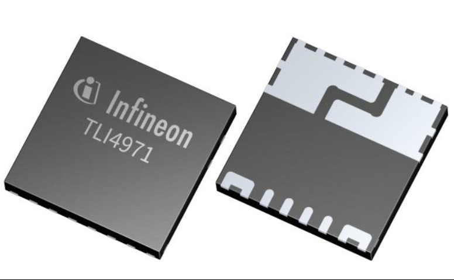
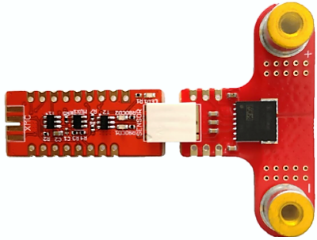

# TLI4971-Current-Sensor


C++ library of Infineon's **Magnetic Hall TLI4971 Current Sensor**

 1. [Overview](#ovw)
 2. [Supported Hardware](#s-hw)
 3. [Software Requirements](#sw-req)
 4. [Library Usage](#lib-usage)
 5. [References](#refs)

<a name="ovw"></a>

## 1. Overview

### TLI4971 Description

TLI4971 is a high precision miniature coreless magnetic current sensor for AC and DC measurements with analog interface and dual fast over-current detection outputs.
Infineon's well-established and robust monolithic Hall technology enables accurate and highly linear measurement of currents with a full scale up to ±120A. All negative effects (saturation, hysteresis) commonly known from open loop sensors using flux concentration techniques are avoided. The sensor is equipped with internal self-diagnostic feature.

Typical applications are electrical drives (up to 690V), current monitoring, chargers, photovoltaic, general purpose inverters, power supplies, overload and over-current detection. The digitally assisted analog concept of TLI4971 offers superior stability over temperature and lifetime thanks to the proprietary digital stress and temperature compensation. The differential measurement principle allows great stray field suppression for operation in harsh environments. The integrated primary conductor (current rail) with very low insertion resistance minimizes the power loss and enables miniaturization of sensing circuitry. A small 8mm x 8mm leadless package (QFN-like) allows for standard SMD assembly. 
Two separate interfae pins (OCD) provide a fast output signal in case a current exceeds a pre-set threshold. The sensor is shipped as a full calibrated product without requiring any customer end-of-line calibration.

The high configurability enables customization for a wide variety of applications. All user-programmable parameters such as OCD thresholds, blanking times and output configuration mode are stored in an embedded EEPROM memory. Programming of the memory can be performed in-situ through a Serial Inspection and Configuration Interface (SICI).

 

### TLI4971 Features 

* Smallest form factor, 8x8mm SMD, for easy integration and board area saving
* Single supply voltage, 3.1V to 3.5V
* High accurate, scalable, DC & AC current sensing
* Full scale up to ±120 A
* Bandwidth greater than 120kHz enables wide range of applications
* Low phase delay (< 48° at bandwidth frequency) for easy closed loop control
* Very low sensitivity error over temperature (2.5%)
* Excellent stability of offset over temperature and lifetime.
* Integrated shield provides high robustness to voltage slew rates up to 10V/ns
* Galvanic functional isolation up to 1150V peak VIORM. Partial discharge capability of at least 1200V.
* Differential sensor principle ensures superior magnetic stray field suppression
* Two independent fast Over-Current Detection (OCD) pins with configurable thresholds enable protection mechanisms for power circuitry (typical < 1.5μs)
* Ratiometric and non ratiometric analog output
* Precalibrated

### TLI4971 Applications

The TLI4971 is suitable for AC as well as DC current measurement applications:
* Electrical drives
* Current monitoring
* Chargers
* Photovoltaic & general purpose inverters
* Power supplies (SMPS)
* Overload and over-current detection

<a name="s-hw"></a>

## 2. Supported Hardware

### TLI4971 Shield2Go
The library has been customized for the **TLI4971** modular Shield2Go and the Arduino environment. 



The complete documentation as schematic and pinout diagram of the boards is included in the **Quick Start Guide**:
* [TLE4971 S2Go](websitelink) 

### Verified Hardware Platforms

The library examples have been built and successfully executed on the following hardware platforms:

MCU Platforms |
---           |
[XMC 2Go](https://www.infineon.com/cms/en/product/evaluation-boards/kit_xmc_2go_xmc1100_v1/) | 
[XMC1100 Boot Kit](https://www.infineon.com/cms/en/product/evaluation-boards/kit_xmc11_boot_001/#ispnTab1) |
[XMC4700 Relax Kit for 5V Shields](https://www.infineon.com/cms/en/product/evaluation-boards/kit_xmc47_relax_5v_ad_v1/) |
[Arduino Uno Rev3](https://store.arduino.cc/arduino-uno-rev3) |   

The Shield2Go form factor is designed to be stacked directly into the XCM 2Go microcontroller board. The [MyIoT Adapter Shield](https://www.infineon.com/cms/en/product/evaluation-boards/my-iot-adapter/) can be used to attach the Shield2Go with any Arduino UNO hardware compatible boards. 


The firmware pin allocation is configured for the usage of **Socket 1** of the MyIoT Adapter Shield. The **Socket 2/3 configuration is not available**.


Check the [Quick Start Guide](https://www.infineon.com/dgdl/Infineon-quick_starter_guide-Shield2Go_MY_IoT_Adapter-GS-v01_00-EN.pdf?fileId=5546d462677d0f460167bbdbd8521af9) for the complete information and pinout diagram of the MyIoT adapter.

#### Additional hardware platforms 

The library is meant to be directly compatible with any other Arduino UNO platforms. Any new validated hardware platform will be added to the MCU Platforms list above.

For any other custom configuration, please check the specific PCB documentation. The information about the IC components can be found in their respective datasheets [TLI4971](), and the overall Infineon´s [Current Sensors documentation](https://www.infineon.com/cms/en/product/sensor/current-sensors/) on the Infineon website. 

<a name="sw-req"></a>

## 3. Software Requirements

### Supported Toolchain Software 

The library examples has been built successfully with the following toolchain software:

Framework | IDE         | Versions                    | MCU Platform Core Libs        | Versions  
---       | ---         |---                          | ---                           |--- 
Arduino   | Arduino IDE | 1.8.9                       | [XMC for Arduino](https://github.com/Infineon/XMC-for-Arduino)     | 1.2.1     
Arduino   | PlatformIO  | Home 2.0.2·Core + 4.0.0a8   | [Infineon XMC](https://github.com/Infineon/platformio-infineonxmc) | 1.1.2 

### Software Dependencies

The official Arduino UNO platform, the library [One Wire](https://github.com/PaulStoffregen/OneWire) is required. Please install it before using the TLI4971 library. 
For XMC microntroller platforms, no other dependencies than the **MCU Platform Core Libs** exist (check how to install them in the Library Usage [section](#lib-usage)).

<a name="lib-usage"></a>

## 4. Library Usage

### Source Code Documentation

Find the source code documentation in **Doxygen** format on the following [link](https://infineon.github.io/TLI4971-Current-Sensor/).

### Arduino IDE

If you are new to Arduino IDE, please [download](https://www.arduino.cc/en/Main/Software) and install it first.

The official Arduino Boards are already available in the IDE, but other third party boards as the Infineon XMC MCU based need to be explicitly included. Follow the instructions in the [link](https://github.com/Infineon/XMC-for-Arduino#installation-instructions) to add the XMC board family to Arduino. Once installed, you can select the one of the supported board from the menu *Tools > Board:...* and configure its parameters.

Then we simply need to install the library to use it in your project:

1. **Install the library**. Download this library as a .zip file (get the latest release version [here]()). Install the library in the Arduino IDE in the menu *Sketch > Include Library > Add .ZIP library*.

2. **Include it in your sketch**. With the library installed in the Arduino IDE, you can include it from the menu "Sketch > Include Library > TLI4071-Current-Sensor". The header ``` #include <TLI4971.h> ``` will be added to your sketch. You can also open and test one of the examples provided in  *File > Examples > TLI4971-Current-Sensor* (find an example in the [Demo Application Example](#demo-ex) section).

### PlatformIO 

If you are new to PlatformIO, download and install first Visual Studio Code and the PlatformIO plugin. Please follow the instructions on the [official website](https://docs.platformio.org/en/latest/ide/pioide.html). Then go through [this tutorial](https://diyprojects.io/install-ide-platformio-extension-visual-studio-code-vscode-windows-32-bit-linux/#.XOVQP44zYnI) to get started with PlatformIO in VSCode and create a new project. 

With the project created, now the library and its dependencies can be configured in the ***Platform.ini* Project File**. This file, located in the project root folder, includes one (or several) building environments *[env:__]*. In the *environment* section, the platform, board, and framework are specified. PlatformIO will take care of downloading and installing all dependencies.
In the following example, we use the XMC 2Go Evaluation Kit (only available for Arduino):

```
[env:xmc1100_xmc2go]
platform = infineonxmc
board = xmc1100_xmc2go
framework = arduino

lib_deps =
# Using a library name
TLI4971-Current-Sensor
    
# Using the repository URL
    https://github.com/Infineon/TLI4971-Current-Sensor.git#master
```

<a name="refs"></a>  

## 6. References

### Related Products

* [TLI4971]()
* [TLI4971 S2Go]()
* [XMC 2Go](https://www.infineon.com/cms/en/product/evaluation-boards/kit_xmc_2go_xmc1100_v1/) 
* [XMC1100 Boot Kit](https://www.infineon.com/cms/en/product/evaluation-boards/kit_xmc11_boot_001/#ispnTab1) 
* [XMC4700 Relax Kit for 5V Shields](https://www.infineon.com/cms/en/product/evaluation-boards/kit_xmc47_relax_5v_ad_v1/) 
* [Arduino Uno Rev3](https://store.arduino.cc/arduino-uno-rev3) 

### Related Repositories
 - [Infineon Github](https://github.com/Infineon)
 - [XMC for Arduino](https://github.com/Infineon/XMC-for-Arduino)
 - [Infineon XMC Platformio](https://github.com/Infineon/platformio-infineonxm)

### Useful Links
 - [Infineon for Makers](https://www.infineon.com/cms/en/tools/landing/infineon-for-makers/)
 - [Arduino](https://www.arduino.cc/)
 - [PlatformIO](https://platformio.org/)
